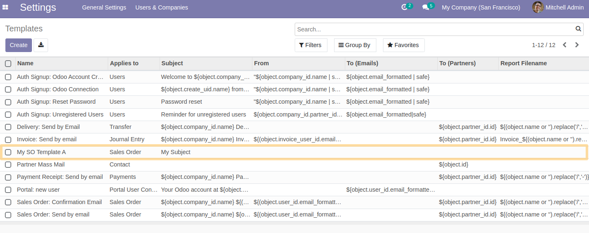
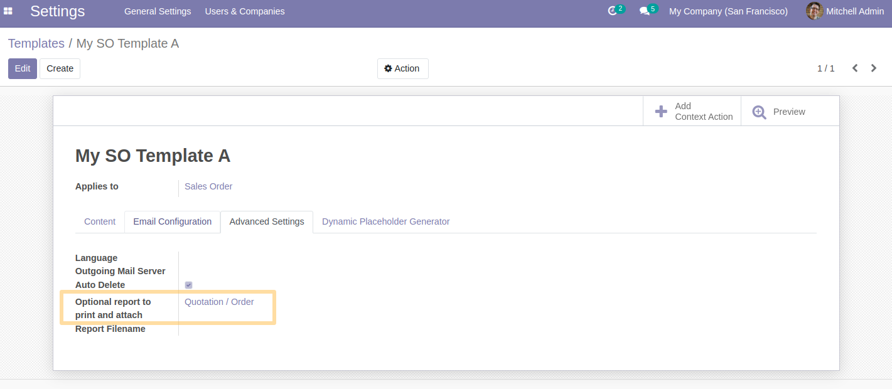
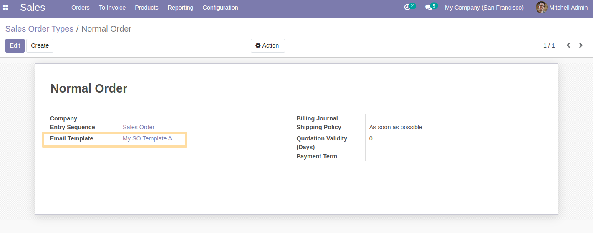
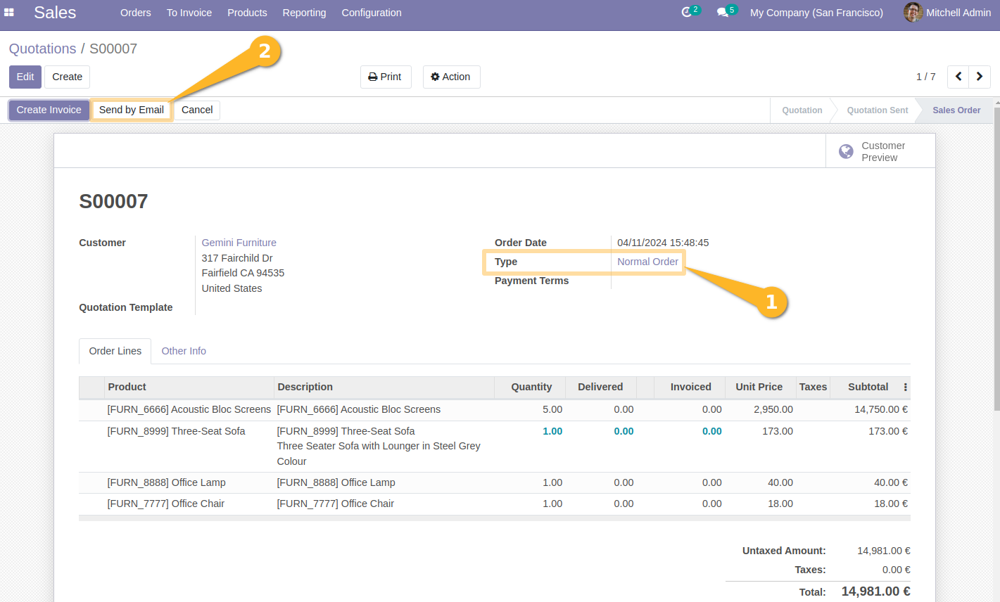
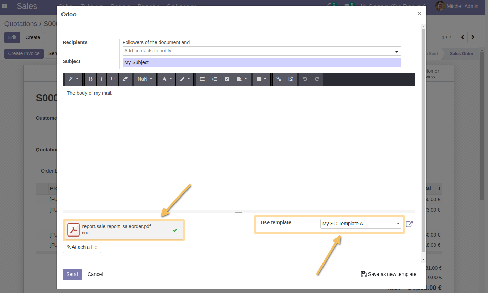

Sale Order Type Email Template
==============================
This module allows to sent different email template based on the sale order type.

Usage
-----
*Configuration*
As a user with access to email templates, I create an email template per order type.

I configure a Qweb report to use (or using Aeroo report).

As a sales administrator, I access order types from the `Sales > Configuration > Sale Order Types` menu. 
From the form view, I see that a new `Email Template` field is available.

For each type of order, I define the email template to use.

*Use Case*
As a sales user, I create a quotation. 
Then, I select the type of quotation, then I send it by email by clicking on the `Send by Email` button.

I see that the appropriate email template is chosen as well as the PDF report:

Contributors
------------
* Numigi (tm) and all its contributors (https://bit.ly/numigiens)
