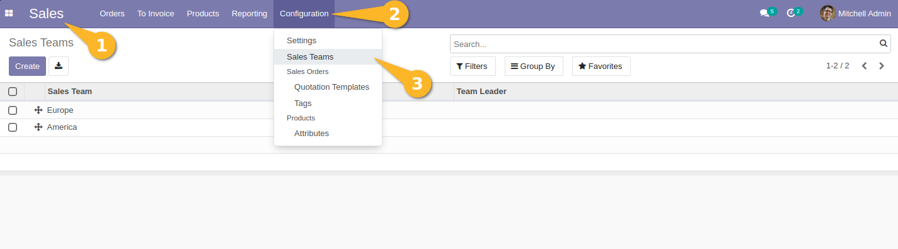
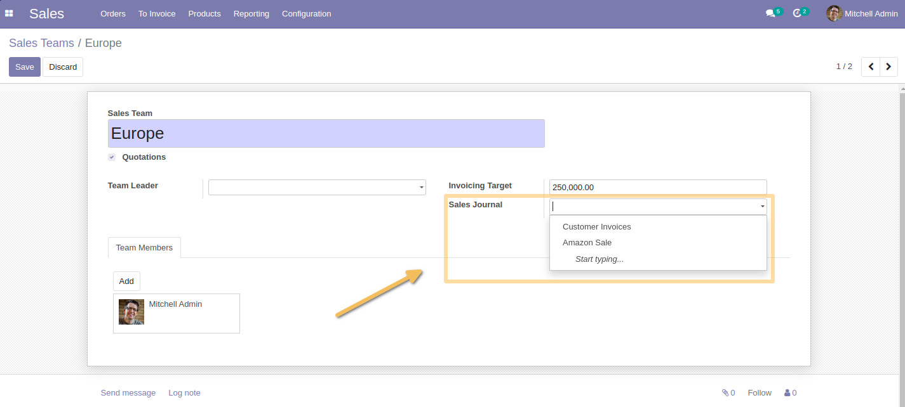
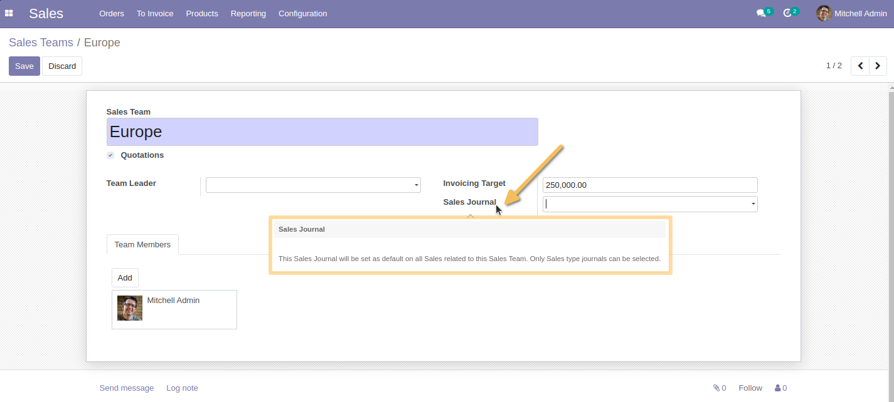
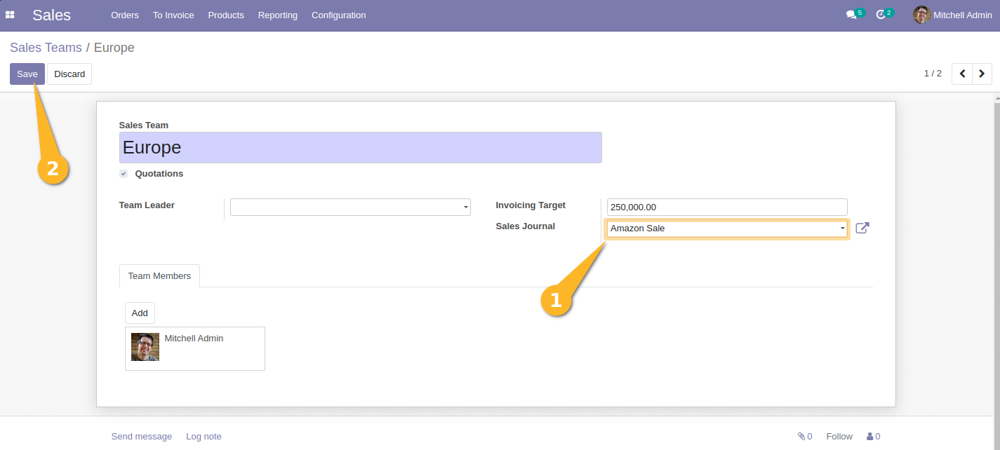
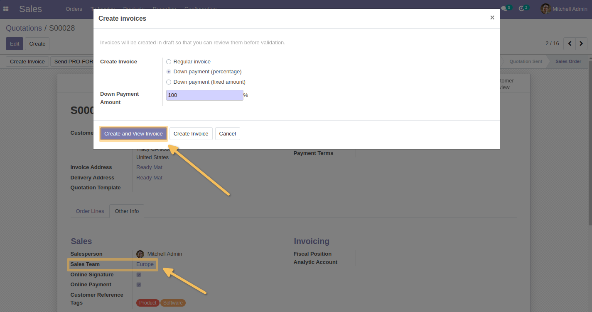
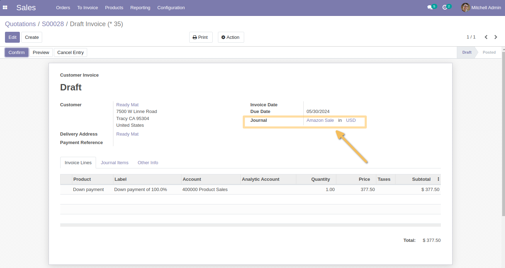

Sales Team Account Journal
==========================
This module allows to define a default sales journal on a sales team
and assign this sales journal to all invoices linked to this sales team.

Features
--------
**New Sales Journal field on sales team**
As a user in the Sales/Manager group, I go to `Sales > Configuration > Sales Teams`.  
I create a new sales team or click on an existing sales team.

I see that a new `Sales Journal` field is available.

On hover, I see that the following help field is available:

I select the `Amazon Sale` journal and save.

Usage
-----
As the `Accounting > Billing Administrator` user, I go to a customer sales order
for which the sales team is linked to Amazon Sale journal.
I create the invoice and post it.

On the draft invoice, I see that the sales journal is Amazon Sale.

Important notes
---------------
-If the sales journal is not set on the sales team, vanilla behavior is applied.
-If the currency of the journal defined on the sales team is different
from the currency of the invoice created, the vanilla behavior applies 
(i.e. the system will assign to the invoice the first sales journal that is in the currency of the invoice).

Contributors
------------
* Numigi (tm) and all its contributors (https://bit.ly/numigiens)
